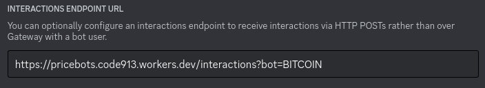

# pricebots
Written in python by Paulie, being rewritten in javascript by [code913](https://code913.devpage.me) for [napkin.io](https://napkin.io).

Setup:
1. Install nodejs.
2. Create a cloudflare account (no credit card required).
3. Install wrangler with `npm i -g wrangler`.
4. Login to wrangler with `wrangler login`.
5. Clone this repository and `cd` into it.
6. Set the following environment variables using the `wrangler secret put VARIABLE_NAME` command:
    - An api key from [scraperapi.com](https://scraperapi.com) as `SCRAPER_API_KEY`.
    - Discord bot tokens and their application public keys for each of the currencies mentioned in the src/tickers.ts file.

Tokens should be in the format `TOKEN_CAPITALIZEDDISPLAYNAME` and public keys in the format `PUBLIC_KEY_CAPITALIZEDDISPLAYNAME`. the display name of the currency is the second value in the map  
for example:
```ts
["algorand", "Algo"],
["apecoin", "Ape"],
["cosmos", "Atom"],
["avalanche-2", "Avax"],
```
becomes
```
TOKEN_ALGO
TOKEN_APE
TOKEN_ATOM
TOKEN_AVAX

PUBLIC_KEY_ALGO
PUBLIC_KEY_APE
PUBLIC_KEY_ATOM
PUBLIC_KEY_AVAX
```
7. After setting the variables run `wrangler deploy` and copy the returned deployment url (it should look like `pricebots.something.workers.dev`)
8. Go to discord dev portal, and for each bot go to the interactions endpoint url input and set as `<the url>/interactions?bot=<capitalized display name>`  
  for example: to set bitcoin bot's url  
  
